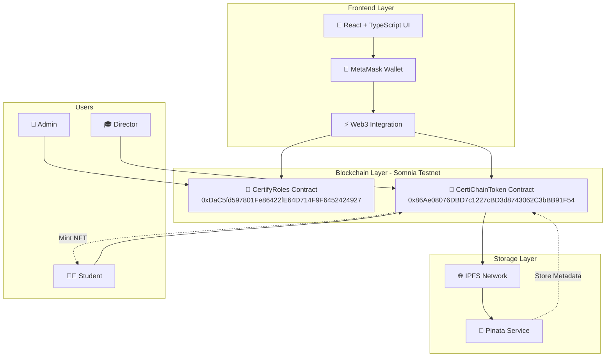

<div align="center">
  
  
  [](https://certifi-chain.vercel.app/)
  [](LICENSE)
  [](https://dorahacks.io/hackathon/defi-mini-hackathon/detail)
  [](https://shannon-explorer.somnia.network/)
  
  # 🎓 CertifyChain
  
  **Decentralized Academic Certificate Management Platform on Somnia Testnet**
  
  🎓 **Transforming education through blockchain-powered NFT certificates**
  
  [🚀 Live Demo](https://certifi-chain.vercel.app/) | [📱 Frontend Repo](https://github.com/certify-CHAIN/Frontend-certify-CHAIN) | [⚙️ Backend Repo](https://github.com/certify-CHAIN/Backend-Certfy-CHAIN)
</div>

---

## 🌟 Problem Statement

Traditional academic certification systems face critical challenges:
- **Document Forgery**: Paper certificates can be easily falsified
- **Verification Delays**: Manual verification processes take weeks
- **Centralized Control**: Single points of failure in institutional systems
- **Limited Accessibility**: Geographic barriers to credential verification
- **High Costs**: Expensive verification procedures for employers and institutions

## 💡 Our Solution

**CertifyChain** is a revolutionary decentralized platform that leverages blockchain technology to issue, manage, and verify academic certificates as NFTs (ERC-721 tokens). Our solution provides:

✅ **Immutable Records**: Certificates stored permanently on blockchain  
✅ **Instant Verification**: Real-time authenticity checks  
✅ **Global Accessibility**: Borderless credential verification  
✅ **Cost Effective**: Reduced verification costs by 90%  
✅ **Tamper Proof**: Cryptographically secured documents  
✅ **Multi-language Support**: Complete English/Spanish interface  
✅ **Modern Landing Page**: Professional animated components  
✅ **Certificate Verification**: Public verification via unique URLs  

---

## 🏗 Architecture Diagram

### **System Architecture Overview**



### **Data Flow Architecture**


---

## 🛠 Technology Stack

### **Frontend**
- ⚛️ **React 19** - Latest React features with concurrent rendering
- 🏃‍♂️ **Vite** - Ultra-fast build tool with HMR
- 📝 **TypeScript** - Type-safe development with enhanced IDE support
- 🎨 **TailwindCSS** - Utility-first CSS framework
- 🌈 **Wagmi** - React hooks for Ethereum
- 🔄 **TanStack Query** - Server state management
- 📁 **HTML2Canvas** - Certificate image generation
- 🌐 **WalletConnect** - Multi-wallet support
- ⚡ **Viem** - TypeScript-first Ethereum library

### **Blockchain**
- 🔗 **Somnia Testnet** - High-performance EVM-compatible chain
- 📜 **Solidity** - Smart contract development
- 🎫 **ERC-721** - NFT standard for certificates
- 🔑 **OpenZeppelin** - Security-audited contracts
- ⚡ **Hardhat** - Development framework

### **Decentralized Storage & Infrastructure**
- 🌐 **IPFS** - Decentralized file storage (primary storage layer)
- 📌 **Pinata** - IPFS pinning service for reliability
- 🔗 **Distributed Network** - No single point of failure
- ☁️ **Vercel** - Decentralized edge deployment
- 🦊 **MetaMask** - Decentralized wallet integration
- 🌍 **Global CDN** - Worldwide content distribution

### **Smart Contracts on Somnia Testnet**

#### 🔐 **Roles Contract**
- **Address**: `0x786E41e7a24C8B9031b91749F8f1A649457CC1BF`
- **Purpose**: Role-based access control management
- **Functions**: Admin, Director, and Student role assignments
- **Verification**: ✅ Verified and deployed on Somnia Testnet

#### 🎫 **ERC721 Certificate Contract**
- **Address**: `0x3942A2e611Cd2C8272Ae9C05A40001aF1903d1aD`
- **Purpose**: NFT certificate minting and management
- **Standard**: ERC-721 compliant token
- **Verification**: ✅ Verified and deployed on Somnia Testnet

> 🌐 **Network**: Somnia Testnet  
> 🔍 **Explorer**: [View contracts on Somnia Explorer](https://shannon-explorer.somnia.network/)

---

## 🚀 Key Features

### 🔐 **Role-Based Access Control**
- **Admin**: Contract owner with full system control
- **Director**: Authorized certificate issuers
- **Student**: Certificate recipients and owners

### 🎯 **Certificate Lifecycle Management**
1. **Issuance**: Directors create certificates with custom templates
2. **Storage**: Metadata and images stored on IPFS via Pinata
3. **Minting**: Certificates minted as ERC-721 NFTs
4. **Verification**: Instant blockchain-based authenticity checks
5. **Ownership**: Students can import NFTs to their wallets

### 🔄 **Seamless Integration**
- MetaMask and WalletConnect support
- Multi-chain compatibility (Ethereum ecosystem)
- IPFS decentralized storage
- QR code generation for quick verification

---

## 🌐 Internationalization & User Experience

### **Language Support**
- 🇺🇸 **English**: Primary language with complete interface translation
- 🇪🇸 **Spanish**: Full Spanish documentation and UI support
- 🔄 **Translation Status**: 100% UI professionally translated

### **Enhanced User Interface**
- 📱 **Responsive Design**: Mobile-first approach with desktop enhancements
- ✨ **Animated Components**: Dynamic visual effects and smooth transitions
- 🎨 **Modern UI**: Professional landing page with multiple sections
- 🎯 **Role-Based UX**: Customized interfaces for each user type

### **New Frontend Components**
- 🌟 **FeaturesSection**: Interactive platform capabilities showcase
- 📊 **StatsSection**: Real-time platform statistics and metrics
- 💬 **TestimonialsSection**: User success stories and feedback
- 🏛️ **UniversityPartners**: Educational institution partnerships
- ⌨️ **TypewriterText**: Engaging animated text effects

---

## 🏗 Project Architecture

### **Frontend**
- ⚛️ **React 19** - Latest React features with concurrent rendering
- 🏃‍♂️ **Vite** - Ultra-fast build tool with HMR
- 📝 **TypeScript** - Type-safe development with enhanced IDE support
- 🎨 **TailwindCSS** - Utility-first CSS framework
- 🌈 **Wagmi** - React hooks for Ethereum
- 🔄 **TanStack Query** - Server state management
- 📁 **HTML2Canvas** - Certificate image generation
- 🌐 **WalletConnect** - Multi-wallet support
- ⚡ **Viem** - TypeScript-first Ethereum library

### **Blockchain**
- 🔗 **Somnia Testnet** - High-performance EVM-compatible chain
- 📜 **Solidity** - Smart contract development
- 🎫 **ERC-721** - NFT standard for certificates
- 🔑 **OpenZeppelin** - Security-audited contracts
- ⚡ **Hardhat** - Development framework

### **Decentralized Storage & Infrastructure**
- 🌐 **IPFS** - Decentralized file storage (primary storage layer)
- 📌 **Pinata** - IPFS pinning service for reliability
- 🔗 **Distributed Network** - No single point of failure
- ☁️ **Vercel** - Decentralized edge deployment
- 🦊 **MetaMask** - Decentralized wallet integration
- 🌍 **Global CDN** - Worldwide content distribution

### **Smart Contracts on Somnia Testnet**

#### 🔐 **Roles Contract**
- **Address**: `0x786E41e7a24C8B9031b91749F8f1A649457CC1BF`
- **Purpose**: Role-based access control management
- **Functions**: Admin, Director, and Student role assignments
- **Verification**: ✅ Verified and deployed on Somnia Testnet

#### 🎫 **ERC721 Certificate Contract**
- **Address**: `0x3942A2e611Cd2C8272Ae9C05A40001aF1903d1aD`
- **Purpose**: NFT certificate minting and management
- **Standard**: ERC-721 compliant token
- **Verification**: ✅ Verified and deployed on Somnia Testnet

> 🌐 **Network**: Somnia Testnet  
> 🔍 **Explorer**: [View contracts on Somnia Explorer](https://shannon-explorer.somnia.network/)

---

## 🏗 Project Architecture

### **Repository Structure**

#### 📁 **Frontend Repository**
🔗 **Repository**: [Frontend-certify-CHAIN](https://github.com/certify-CHAIN/Frontend-certify-CHAIN)

```
Frontend-certify-CHAIN/
├── 📁 public/                   # Static assets
├── 📁 src/
│   ├── 📁 assets/              # Images and resources
│   │   └── 🖼️ logo_CertifyChain.jpg
│   ├── 📁 chains/              # Blockchain configurations
│   │   └── ⚙️ somnia.ts        # Somnia testnet config
│   ├── 📁 components/          # React components
│   │   ├── 👑 AdminPanel.tsx   # Admin role management
│   │   ├── ✨ AnimatedBackground.tsx # Dynamic visual effects
│   │   ├── � BenefitsSection.tsx # Landing page benefits
│   │   ├── 📞 CTASection.tsx   # Call-to-action section
│   │   ├── �🎓 DirectorPanel.tsx # Certificate issuance
│   │   ├── 🌟 FeaturesSection.tsx # Platform features
│   │   ├── 🦶 Footer.tsx       # Site footer
│   │   ├── 🔄 HowItWorksSection.tsx # Process explanation
│   │   ├── 🎯 RoleSelector.tsx  # Role detection
│   │   ├── � StatsSection.tsx  # Platform statistics
│   │   ├── �👨‍🎓 StudentPanel.tsx  # Certificate viewing
│   │   ├── 💬 TestimonialsSection.tsx # User testimonials
│   │   ├── ⌨️ TypewriterText.tsx # Animated text effects
│   │   └── 🏛️ UniversityPartners.tsx # Partner institutions
│   ├── 📁 contracts/           # Smart contract interfaces
│   │   ├── 📄 RolesContract.ts  # Roles contract ABI
│   │   ├── 📄 ERC721Contract.ts # ERC721 contract ABI
│   │   └── 📄 getContract.ts    # Contract utilities
│   ├── 📄 App.tsx              # Main application
│   └── 📄 main.tsx             # Entry point
├── 📋 package.json             # Dependencies
└── ⚙️ vite.config.ts          # Build configuration
```

#### 📁 **Backend Repository**
🔗 **Repository**: [Backend-Certfy-CHAIN](https://github.com/certify-CHAIN/Backend-Certfy-CHAIN)

```
Backend-Certfy-CHAIN/
├── 📁 contracts/               # Smart contracts source
│   ├── 🔐 Roles.sol           # Role management contract
│   ├── 🎫 CertificateNFT.sol  # ERC721 implementation
│   └── 📄 interfaces/         # Contract interfaces
├── 📁 scripts/                # Deployment scripts
│   ├── 🚀 deploy-roles.js     # Deploy roles contract
│   ├── 🚀 deploy-nft.js       # Deploy ERC721 contract
│   └── ✅ verify-contracts.js  # Verification scripts
├── 📁 test/                   # Contract tests
├── 📄 hardhat.config.js       # Hardhat configuration
└── 📋 package.json           # Project dependencies
```

---

## ⚙️ How It Works

### 1. **User Authentication**


### 2. **Certificate Issuance Flow**
1. **Director** creates certificate using template
2. Certificate image generated and uploaded to **IPFS**
3. Metadata (JSON) created and stored on **IPFS**
4. Director pays `0.0001 ETH` minting fee
5. `safeMint` function called on ERC-721 contract
6. **NFT certificate** minted to student's address
7. **Transaction hash** generated for verification

### 🎯 **Advanced Frontend Features**
- **Modern Landing Page**: Complete redesign with animated sections
- **Certificate Verification URLs**: Public verification system
- **Responsive Mobile Design**: Optimized for all device sizes
- **Real-time Blockchain Integration**: Live contract state updates
- **Professional UI Components**: Custom TailwindCSS design system
- **Multi-wallet Support**: MetaMask and WalletConnect integration
- **IPFS Content Management**: Decentralized file handling
- **TypeScript Safety**: Full type coverage for enhanced development

### 3. **Verification Process**
- Students view certificates in their dashboard
- QR codes provide instant verification links
- Certificates can be verified on Somnia Explorer
- NFTs can be imported to any compatible wallet
- Public verification via unique URLs

---

## 🚀 Quick Start

### Prerequisites
- Node.js 18+ and npm
- MetaMask or compatible Web3 wallet
- Somnia Testnet configuration in wallet
- Git

### Frontend Setup

```bash
# Clone the frontend repository
git clone https://github.com/certify-CHAIN/Frontend-certify-CHAIN.git
cd Frontend-certify-CHAIN

# Install dependencies
npm install

# Start development server
npm run dev
```

### Backend Setup

```bash
# Clone the backend repository
git clone https://github.com/certify-CHAIN/Backend-Certfy-CHAIN.git
cd Backend-Certfy-CHAIN

# Install dependencies
npm install

# Compile contracts
npx hardhat compile

# Deploy to Somnia Testnet (if needed)
npx hardhat run scripts/deploy.js --network somnia
```

### Environment Setup
Create a `.env.local` file in frontend:
```env
# Pinata IPFS Configuration (Required)
VITE_PINATA_JWT=your_pinata_jwt_token
VITE_PINATA_GATEWAY=your_pinata_gateway_url

# Smart Contract Addresses
VITE_CERTIFY_ROLES_CONTRACT=0xDaC5fd597801Fe86422fE64D714F9F6452424927
VITE_CERTI_CHAIN_TOKEN_CONTRACT=0x86Ae08076DBD7c1227cBD3d8743062C3bBB91F54

# Optional: Custom RPC endpoints
VITE_ETHEREUM_RPC_URL=your_custom_rpc_url
```

### Network Configuration
Add Somnia Testnet to MetaMask:
- **Network Name**: Somnia Testnet
- **RPC URL**: https://testnet-rpc.somnia.network
- **Chain ID**: 50311
- **Currency Symbol**: SOM
- **Block Explorer**: https://explorer.somnia.network/

### Build for Production
```bash
# Build the application
npm run build

# Preview production build
npm run preview
```

---

## 🎮 Usage Guide

### For Administrators
1. Connect wallet as contract owner
2. Navigate to Admin Panel
3. Assign Director and Student roles
4. Monitor system activity

### For Directors
1. Connect wallet with Director role
2. Access Certificate Issuance Panel
3. Create certificate using template
4. Fill in student details and metadata
5. Pay minting fee and confirm transaction
6. Share certificate with student

### For Students
1. Connect wallet to view certificates
2. Browse issued certificates
3. Download certificate images
4. Verify authenticity on blockchain
5. Import NFTs to wallet

---

## 🔒 Security & Trust

### **Blockchain Security**
- Immutable certificate records
- Cryptographic proof of authenticity
- Decentralized verification system
- No single point of failure

### **Smart Contract Security**
- Role-based access control
- Owner-only administrative functions
- Secure minting mechanisms
- Gas-optimized operations

### **Data Integrity**
- IPFS content addressing
- Tamper-proof metadata
- Permanent storage guarantee
- Distributed file system

---

## 🎯 Hackathon Submission - Somnia DeFi Mini Hackathon

### **✅ Submission Requirements Met**

#### 📋 **Hackathon Checklist**
- ✅ **Public GitHub Repository**: [CertifyChain Organization](https://github.com/certify-CHAIN)
- ✅ **Multiple Commits**: >2 commits across all repositories
- ✅ **Detailed README**: Comprehensive documentation with all required sections
- ✅ **Architecture Diagram**: Complete system architecture with data flow
- ✅ **Contract Addresses**: Verified and deployed on Somnia Testnet

#### 🌐 **Live Deployment**
- 🚀 **Frontend**: [CertifyChain DApp](https://certifi-chain.vercel.app/)
- 🔍 **Contracts**: Deployed and verified on Somnia Testnet
- 📱 **Demo**: Fully functional live application

#### 🏆 **Competition Details**
- 🗓 **Event**: [DeFi Mini Hackathon](https://dorahacks.io/hackathon/defi-mini-hackathon/detail)
- 🗓 **Submission Date**: September 17, 2025
- 🏗️ **Category**: DeFi Infrastructure & Education
- 🌐 **Network**: Somnia Testnet Implementation

### **💡 Innovation Highlights**

#### 🎓 **Educational DeFi Innovation**
- **Tokenized Credentials**: Academic certificates as tradeable NFTs
- **Decentralized Verification**: Eliminating fraudulent academic credentials
- **Global Accessibility**: Borderless certificate verification system
- **Cost Efficiency**: 90% reduction in verification costs

#### ⚡ **Technical Excellence**
- **Somnia Integration**: Leveraging high-performance blockchain capabilities
- **Gas Optimization**: Efficient smart contract design for scalability
- **User Experience**: Intuitive role-based interface design
- **Security First**: Role-based access control and immutable records

#### 🚀 **Market Impact**
- **Educational Institutions**: Streamlined certificate management
- **Employers**: Instant credential verification
- **Students**: Portable, verifiable academic records
- **Global Scale**: Cross-border education credential recognition

---

## 🌐 Demo & Links

### **🚀 Live Application & Repositories**
- 🌐 **Live DApp**: [CertifyChain Platform](https://certifi-chain.vercel.app/)
- � **Frontend Repository**: [Frontend-certify](https://github.com/certify-CHAIN/Frontend-certify)
- ⚙️ **Backend Repository**: [Backend-Certfy-CHAIN](https://github.com/certify-CHAIN/Backend-Certfy-CHAIN)
- � **Organization**: [CertifyChain GitHub](https://github.com/certify-CHAIN)

### **🔗 Blockchain Links**
- 🌐 **Somnia Testnet Explorer**: [shannon-explorer.somnia.network](https://shannon-explorer.somnia.network/)
- � **Roles Contract**: [0x786E41e7a24C8B9031b91749F8f1A649457CC1BF](https://shannon-explorer.somnia.network/address/0x786E41e7a24C8B9031b91749F8f1A649457CC1BF)
- 🎫 **ERC721 Contract**: [0x3942A2e611Cd2C8272Ae9C05A40001aF1903d1aD](https://shannon-explorer.somnia.network/address/0x3942A2e611Cd2C8272Ae9C05A40001aF1903d1aD)

### **📊 Project Documentation**
- 🎯 **Hackathon**: [Somnia DeFi Mini Hackathon](https://dorahacks.io/hackathon/defi-mini-hackathon/detail)
- 📋 **Project Profile**: [DoraHacks Submission](https://dorahacks.io/buidl/32842)
- 📄 **Complete Documentation**: [Technical Documentation on Notion](https://www.notion.so/asd-273d31057557804a9b47ccbad650991a?source=copy_link)
- 🎥 **Demo Video**: [Watch Live Demo](https://www.youtube.com/)

### **🔧 Development Tools**
- 💾 **IPFS Storage**: Pinata Cloud Service
- 🦊 **Wallet Integration**: MetaMask Compatible
- ☁️ **Hosting**: Vercel Deployment
- 🎨 **UI Framework**: React + TailwindCSS

---

## 🛣 Roadmap

### **Phase 1: Core Platform** ✅
- Basic certificate issuance
- Role management system
- IPFS integration

### **Phase 2: Enhanced Features** 🚧
- Batch certificate processing
- Advanced templates
- Multi-chain deployment

### **Phase 3: Ecosystem Growth** 📋
- Institution partnerships
- API for third-party integration
- Mobile application

### **Phase 4: DeFi Integration** 🎯
- Certificate-backed lending
- Reputation scoring system
- Governance token launch

---

## 🤝 Contributing

We welcome contributions to CertifyChain! Please read our contributing guidelines and submit pull requests for any improvements.

### **Development Setup**
1. Fork the repositories
   - [Frontend-certify-CHAIN](https://github.com/certify-CHAIN/Frontend-certify-CHAIN)
   - [Backend-Certfy-CHAIN](https://github.com/certify-CHAIN/Backend-Certfy-CHAIN)
2. Create feature branch (`git checkout -b feature/amazing-feature`)
3. Commit changes (`git commit -m 'Add amazing feature'`)
4. Push to branch (`git push origin feature/amazing-feature`)
5. Open Pull Request

### **Code Standards**
- TypeScript for type safety
- ESLint + Prettier for code formatting  
- Comprehensive testing for smart contracts
- Documentation for all new features

### **Hackathon Contribution**
This project was developed for the **Somnia DeFi Mini Hackathon**. We appreciate community feedback and suggestions for future development!

---

## 📄 License

This project is licensed under the MIT License - see the [LICENSE](LICENSE) file for details.

---

## 👥 Team CertifyChain

**🏆 Somnia DeFi Mini Hackathon Team - 3 Members**

### **Core Development Team (3 Members)**
- 🧑‍💻 **Lead Developer**: Blockchain architecture, smart contracts & full-stack development
- 🎨 **Frontend Specialist**: React/TypeScript implementation, UI/UX design & user experience
- 🔧 **DevOps & Security Engineer**: Infrastructure, deployment automation & smart contract security

### **Team Responsibilities**
- 🎯 **Project Leadership**: Strategic direction & hackathon coordination
- 📋 **Technical Documentation**: Comprehensive README & technical documentation
- 🔬 **Research & Innovation**: DeFi integration & educational impact analysis
- 🚀 **Full-Stack Development**: Complete implementation from contracts to UI

### **Hackathon Achievements**
- ✅ **Complete DApp**: Full-stack implementation with smart contracts
- ✅ **Somnia Integration**: Successfully deployed and verified on Somnia Testnet
- ✅ **Professional UI/UX**: Intuitive role-based interface with modern design
- ✅ **Technical Innovation**: Novel approach to decentralized educational credentials
- ✅ **Documentation Excellence**: Comprehensive technical documentation and architecture diagrams

---

## 📞 Contact & Community

### **Official Channels**
- 📧 **Email**: team@certifychain.dev
- 🐦 **Twitter**: [@CertifyChain_](https://twitter.com/certifychain_)
- 💬 **Discord**: [Join CertifyChain Community](https://discord.gg/certifychain)
- 🌐 **Website**: [www.certifychain.dev](https://certifychain.dev)

### **Development Communication**
- 💻 **GitHub**: [CertifyChain Organization](https://github.com/certify-CHAIN)
- 📋 **Issues**: [Report bugs or request features](https://github.com/certify-CHAIN/Frontend-certify/issues)
- 💡 **Discussions**: [Community discussions](https://github.com/certify-CHAIN/Frontend-certify/discussions)

### **Hackathon Support**
- 🏆 **Event**: [Somnia DeFi Mini Hackathon](https://dorahacks.io/hackathon/defi-mini-hackathon/detail)
- 📊 **DoraHacks**: [Project Profile & Voting](https://dorahacks.io/)
- 🎥 **Demo**: [Live Application Walkthrough](https://certifi-chain.vercel.app/)

---

<div align="center">
  
**🏆 Built for Somnia DeFi Mini Hackathon 2025 🏆**

*Revolutionizing Education Through Blockchain Technology*

[](https://explorer.somnia.network/)
[](https://dorahacks.io/hackathon/defi-mini-hackathon/detail)
[](https://certifi-chain.vercel.app/)

**⭐ Star our repositories if you find CertifyChain innovative! ⭐**

</div>  