<div align="center">
  
  
  [](https://certifi-chain.vercel.app/)
  [](LICENSE)
  [](https://dorahacks.io/hackathon/defi-mini-hackathon/detail)
  [](https://explorer.somnia.network/)
  
  # 🎓 CertifyChain
  
  **Decentralized Academic Certificate Management Platform on Somnia Testnet**
  
  🎓 **Transforming education through blockchain-powered NFT certificates**
  
  [🚀 Live Demo](https://certifi-chain.vercel.app/) | [� Frontend Repo](https://github.com/certify-CHAIN/Frontend-certify) | [⚙️ Backend Repo](https://github.com/certify-CHAIN/Backend-Certfy-CHAIN)
</div>

---

## 🌟 Problem Statement

Traditional academic certification systems face critical challenges:
- **Document Forgery**: Paper certificates can be easily falsified
- **Verification Delays**: Manual verification processes take weeks
- **Centralized Control**: Single points of failure in institutional systems
- **Limited Accessibility**: Geographic barriers to credential verification
- **High Costs**: Expensive verification procedures for employers and institutions

## 💡 Our Solution

**CertifyChain** is a revolutionary decentralized platform that leverages blockchain technology to issue, manage, and verify academic certificates as NFTs (ERC-721 tokens). Our solution provides:

✅ **Immutable Records**: Certificates stored permanently on blockchain  
✅ **Instant Verification**: Real-time authenticity checks  
✅ **Global Accessibility**: Borderless credential verification  
✅ **Cost Effective**: Reduced verification costs by 90%  
✅ **Tamper Proof**: Cryptographically secured documents  

---

## 🚀 Key Features

### 🔐 **Role-Based Access Control**
- **Admin**: Contract owner with full system control
- **Director**: Authorized certificate issuers
- **Student**: Certificate recipients and owners

### 🎯 **Certificate Lifecycle Management**
1. **Issuance**: Directors create certificates with custom templates
2. **Storage**: Metadata and images stored on IPFS via Pinata
3. **Minting**: Certificates minted as ERC-721 NFTs
4. **Verification**: Instant blockchain-based authenticity checks
5. **Ownership**: Students can import NFTs to their wallets

### 🔄 **Seamless Integration**
- MetaMask and WalletConnect support
- Multi-chain compatibility (Ethereum ecosystem)
- IPFS decentralized storage
- QR code generation for quick verification

---

## 🛠 Technology Stack

### **Frontend**
- ⚛️ **React 19** - Modern UI framework
- 🏃‍♂️ **Vite** - Lightning-fast build tool
- 📝 **TypeScript** - Type-safe development
- 🎨 **TailwindCSS** - Utility-first styling
- 🌈 **Wagmi** - Web3 React hooks

### **Blockchain**
- 🔗 **Somnia Testnet** - High-performance EVM-compatible chain
- 📜 **Solidity** - Smart contract development
- 🎫 **ERC-721** - NFT standard for certificates
- 🔑 **OpenZeppelin** - Security-audited contracts
- ⚡ **Hardhat** - Development framework

### **Storage & Infrastructure**
- 🌐 **IPFS** - Decentralized file storage
- 📌 **Pinata** - IPFS pinning service
- ☁️ **Vercel** - Deployment platform
- 🦊 **MetaMask** - Wallet integration

### **Smart Contracts on Somnia Testnet**

#### 🔐 **Roles Contract**
- **Address**: `0x786E41e7a24C8B9031b91749F8f1A649457CC1BF`
- **Purpose**: Role-based access control management
- **Functions**: Admin, Director, and Student role assignments
- **Verification**: ✅ Verified and deployed on Somnia Testnet

#### 🎫 **ERC721 Certificate Contract**
- **Address**: `0x3942A2e611Cd2C8272Ae9C05A40001aF1903d1aD`
- **Purpose**: NFT certificate minting and management
- **Standard**: ERC-721 compliant token
- **Verification**: ✅ Verified and deployed on Somnia Testnet

> 🌐 **Network**: Somnia Testnet  
> 🔍 **Explorer**: [View contracts on Somnia Explorer](https://explorer.somnia.network/)

---

## 🏗 Architecture Diagram

### **System Architecture Overview**

```mermaid
graph TB
    subgraph "Frontend Layer"
        UI[🎨 React + TypeScript UI]
        WALLET[🦊 MetaMask Wallet]
        WEB3[⚡ Web3 Integration]
    end
    
    subgraph "Blockchain Layer - Somnia Testnet"
        ROLES[🔐 Roles Contract<br/>0x786E41e7a24C8B9031b91749F8f1A649457CC1BF]
        ERC721[🎫 ERC721 Contract<br/>0x3942A2e611Cd2C8272Ae9C05A40001aF1903d1aD]
    end
    
    subgraph "Storage Layer"
        IPFS[🌐 IPFS Network]
        PINATA[📌 Pinata Service]
    end
    
    subgraph "Users"
        ADMIN[👑 Admin]
        DIRECTOR[🎓 Director]
        STUDENT[👨‍🎓 Student]
    end
    
    UI --> WALLET
    WALLET --> WEB3
    WEB3 --> ROLES
    WEB3 --> ERC721
    
    ADMIN --> ROLES
    DIRECTOR --> ERC721
    STUDENT --> ERC721
    
    ERC721 --> IPFS
    IPFS --> PINATA
    
    PINATA -.->|Store Metadata| ERC721
    ERC721 -.->|Mint NFT| STUDENT
```



### **Data Flow Architecture**


## 🏗 Project Architecture

### **Repository Structure**

#### 📁 **Frontend Repository**
🔗 **Repository**: [Frontend-certify](https://github.com/certify-CHAIN/Frontend-certify)

```
Frontend-certify/
├── 📁 public/                   # Static assets
├── 📁 src/
│   ├── 📁 assets/              # Images and resources
│   │   └── 🖼️ logo_CertifyChain.jpg
│   ├── 📁 chains/              # Blockchain configurations
│   │   └── ⚙️ somnia.ts        # Somnia testnet config
│   ├── 📁 components/          # React components
│   │   ├── 👑 AdminPanel.tsx   # Admin role management
│   │   ├── 🎓 DirectorPanel.tsx # Certificate issuance
│   │   ├── 👨‍🎓 StudentPanel.tsx  # Certificate viewing
│   │   ├── 🎯 RoleSelector.tsx  # Role detection
│   │   └── ✨ AnimatedBackground.tsx
│   ├── 📁 contracts/           # Smart contract interfaces
│   │   ├── 📄 RolesContract.ts  # Roles contract ABI
│   │   ├── 📄 ERC721Contract.ts # ERC721 contract ABI
│   │   └── 📄 getContract.ts    # Contract utilities
│   ├── 📄 App.tsx              # Main application
│   └── 📄 main.tsx             # Entry point
├── 📋 package.json             # Dependencies
└── ⚙️ vite.config.ts          # Build configuration
```

#### 📁 **Backend Repository**
🔗 **Repository**: [Backend-Certfy-CHAIN](https://github.com/certify-CHAIN/Backend-Certfy-CHAIN)

```
Backend-Certfy-CHAIN/
├── 📁 contracts/               # Smart contracts source
│   ├── 🔐 Roles.sol           # Role management contract
│   ├── 🎫 CertificateNFT.sol  # ERC721 implementation
│   └── 📄 interfaces/         # Contract interfaces
├── 📁 scripts/                # Deployment scripts
│   ├── 🚀 deploy-roles.js     # Deploy roles contract
│   ├── 🚀 deploy-nft.js       # Deploy ERC721 contract
│   └── ✅ verify-contracts.js  # Verification scripts
├── 📁 test/                   # Contract tests
├── 📄 hardhat.config.js       # Hardhat configuration
└── 📋 package.json           # Project dependencies
```

---

## ⚙️ How It Works

### 1. **User Authentication**


### 2. **Certificate Issuance Flow**
1. **Director** creates certificate using template
2. Certificate image generated and uploaded to **IPFS**
3. Metadata (JSON) created and stored on **IPFS**
4. Director pays `0.0001 ETH` minting fee
5. `safeMint` function called on ERC-721 contract
6. **NFT certificate** minted to student's address
7. **Transaction hash** generated for verification

### 3. **Verification Process**
- Students view certificates in their dashboard
- QR codes provide instant verification links
- Certificates can be verified on Etherscan
- NFTs can be imported to any compatible wallet

---

## 🚀 Quick Start

### Prerequisites
- Node.js 18+ and npm
- MetaMask or compatible Web3 wallet
- Somnia Testnet configuration in wallet
- Git

### Frontend Setup

```bash
# Clone the frontend repository
git clone https://github.com/certify-CHAIN/Frontend-certify.git
cd Frontend-certify

# Install dependencies
npm install

# Start development server
npm run dev
```

### Backend Setup

```bash
# Clone the backend repository
git clone https://github.com/certify-CHAIN/Backend-Certfy-CHAIN.git
cd Backend-Certfy-CHAIN

# Install dependencies
npm install

# Compile contracts
npx hardhat compile

# Deploy to Somnia Testnet (if needed)
npx hardhat run scripts/deploy.js --network somnia
```

### Environment Setup
Create a `.env.local` file in frontend:
```env
VITE_PINATA_JWT=your_pinata_jwt_token
VITE_PINATA_GATEWAY=your_pinata_gateway_url
VITE_ROLES_CONTRACT=0x786E41e7a24C8B9031b91749F8f1A649457CC1BF
VITE_ERC721_CONTRACT=0x3942A2e611Cd2C8272Ae9C05A40001aF1903d1aD
```

### Network Configuration
Add Somnia Testnet to MetaMask:
- **Network Name**: Somnia Testnet
- **RPC URL**: https://testnet-rpc.somnia.network
- **Chain ID**: 50311
- **Currency Symbol**: SOM
- **Block Explorer**: https://explorer.somnia.network/

### Build for Production
```bash
# Build the application
npm run build

# Preview production build
npm run preview
```

---

## 🎮 Usage Guide

### For Administrators
1. Connect wallet as contract owner
2. Navigate to Admin Panel
3. Assign Director and Student roles
4. Monitor system activity

### For Directors
1. Connect wallet with Director role
2. Access Certificate Issuance Panel
3. Create certificate using template
4. Fill in student details and metadata
5. Pay minting fee and confirm transaction
6. Share certificate with student

### For Students
1. Connect wallet to view certificates
2. Browse issued certificates
3. Download certificate images
4. Verify authenticity on blockchain
5. Import NFTs to wallet

---

## 🔒 Security & Trust

### **Blockchain Security**
- Immutable certificate records
- Cryptographic proof of authenticity
- Decentralized verification system
- No single point of failure

### **Smart Contract Security**
- Role-based access control
- Owner-only administrative functions
- Secure minting mechanisms
- Gas-optimized operations

### **Data Integrity**
- IPFS content addressing
- Tamper-proof metadata
- Permanent storage guarantee
- Distributed file system

---

## 🎯 Hackathon Submission - Somnia DeFi Mini Hackathon

### **✅ Submission Requirements Met**

#### 📋 **Hackathon Checklist**
- ✅ **Public GitHub Repository**: [CertifyChain Organization](https://github.com/certify-CHAIN)
- ✅ **Multiple Commits**: >2 commits across all repositories
- ✅ **Detailed README**: Comprehensive documentation with all required sections
- ✅ **Architecture Diagram**: Complete system architecture with data flow
- ✅ **Contract Addresses**: Verified and deployed on Somnia Testnet

#### 🌐 **Live Deployment**
- 🚀 **Frontend**: [CertifyChain DApp](https://certifi-chain.vercel.app/)
- 🔍 **Contracts**: Deployed and verified on Somnia Testnet
- 📱 **Demo**: Fully functional live application

#### 🏆 **Competition Details**
- 🗓 **Event**: [DeFi Mini Hackathon](https://dorahacks.io/hackathon/defi-mini-hackathon/detail)
- 🗓 **Submission Date**: September 17, 2025
- 🏗️ **Category**: DeFi Infrastructure & Education
- 🌐 **Network**: Somnia Testnet Implementation

### **💡 Innovation Highlights**

#### 🎓 **Educational DeFi Innovation**
- **Tokenized Credentials**: Academic certificates as tradeable NFTs
- **Decentralized Verification**: Eliminating fraudulent academic credentials
- **Global Accessibility**: Borderless certificate verification system
- **Cost Efficiency**: 90% reduction in verification costs

#### ⚡ **Technical Excellence**
- **Somnia Integration**: Leveraging high-performance blockchain capabilities
- **Gas Optimization**: Efficient smart contract design for scalability
- **User Experience**: Intuitive role-based interface design
- **Security First**: Role-based access control and immutable records

#### 🚀 **Market Impact**
- **Educational Institutions**: Streamlined certificate management
- **Employers**: Instant credential verification
- **Students**: Portable, verifiable academic records
- **Global Scale**: Cross-border education credential recognition

---

## 🌐 Demo & Links

### **🚀 Live Application & Repositories**
- 🌐 **Live DApp**: [CertifyChain Platform](https://certifi-chain.vercel.app/)
- � **Frontend Repository**: [Frontend-certify](https://github.com/certify-CHAIN/Frontend-certify)
- ⚙️ **Backend Repository**: [Backend-Certfy-CHAIN](https://github.com/certify-CHAIN/Backend-Certfy-CHAIN)
- � **Organization**: [CertifyChain GitHub](https://github.com/certify-CHAIN)

### **🔗 Blockchain Links**
- 🌐 **Somnia Testnet Explorer**: [explorer.somnia.network](https://shannon-explorer.somnia.network/)
- � **Roles Contract**: [0x786E41e7a24C8B9031b91749F8f1A649457CC1BF](https://shannon-explorer.somnia.network/address/0x786E41e7a24C8B9031b91749F8f1A649457CC1BF)
- 🎫 **ERC721 Contract**: [0x3942A2e611Cd2C8272Ae9C05A40001aF1903d1aD](https://shannon-explorer.somnia.network/address/0x3942A2e611Cd2C8272Ae9C05A40001aF1903d1aD)

### **📊 Project Documentation**
- 🎯 **Hackathon**: [Somnia DeFi Mini Hackathon](https://dorahacks.io/hackathon/defi-mini-hackathon/detail)
- 📋 **Project Profile**: [DoraHacks Submission](https://dorahacks.io/buidl/32842)
- 📹 **Demo Video**: [Watch Live Demo](https://www.youtube.com/)

### **🔧 Development Tools**
- 💾 **IPFS Storage**: Pinata Cloud Service
- 🦊 **Wallet Integration**: MetaMask Compatible
- ☁️ **Hosting**: Vercel Deployment
- 🎨 **UI Framework**: React + TailwindCSS

---

## 🛣 Roadmap

### **Phase 1: Core Platform** ✅
- Basic certificate issuance
- Role management system
- IPFS integration

### **Phase 2: Enhanced Features** 🚧
- Batch certificate processing
- Advanced templates
- Multi-chain deployment

### **Phase 3: Ecosystem Growth** 📋
- Institution partnerships
- API for third-party integration
- Mobile application

### **Phase 4: DeFi Integration** 🎯
- Certificate-backed lending
- Reputation scoring system
- Governance token launch

---

## 🤝 Contributing

We welcome contributions to CertifyChain! Please read our contributing guidelines and submit pull requests for any improvements.

### **Development Setup**
1. Fork the repositories
   - [Frontend-certify](https://github.com/certify-CHAIN/Frontend-certify)
   - [Backend-Certfy-CHAIN](https://github.com/certify-CHAIN/Backend-Certfy-CHAIN)
2. Create feature branch (`git checkout -b feature/amazing-feature`)
3. Commit changes (`git commit -m 'Add amazing feature'`)
4. Push to branch (`git push origin feature/amazing-feature`)
5. Open Pull Request

### **Code Standards**
- TypeScript for type safety
- ESLint + Prettier for code formatting  
- Comprehensive testing for smart contracts
- Documentation for all new features

### **Hackathon Contribution**
This project was developed for the **Somnia DeFi Mini Hackathon**. We appreciate community feedback and suggestions for future development!

---

## 📄 License

This project is licensed under the MIT License - see the [LICENSE](LICENSE) file for details.

---

## 👥 Team CertifyChain

**🏆 Somnia DeFi Mini Hackathon Team**

### **Development Team**
- 🧑‍💻 **Lead Blockchain Developer**: Smart contract architecture & deployment
- 🎨 **Frontend Developer**: React/TypeScript implementation & UI/UX
- 🔧 **DevOps Engineer**: Infrastructure & deployment automation
- 🔐 **Security Auditor**: Smart contract security & optimization

### **Project Roles**
- 🎯 **Project Lead**: Strategic direction & hackathon coordination
- 📋 **Technical Writer**: Documentation & whitepaper creation
- 🔬 **Researcher**: DeFi integration & educational impact analysis
- � **Community Manager**: Ecosystem development & partnerships

### **Hackathon Achievements**
- ✅ **Full Stack Implementation**: Complete DApp with smart contracts
- ✅ **Somnia Integration**: Successfully deployed on Somnia Testnet
- ✅ **User Experience**: Intuitive role-based interface design
- ✅ **Innovation**: Novel approach to educational credential management

---

## 📞 Contact & Community

### **Official Channels**
- 📧 **Email**: team@certifychain.dev
- 🐦 **Twitter**: [@CertifyChain_](https://twitter.com/certifychain_)
- 💬 **Discord**: [Join CertifyChain Community](https://discord.gg/certifychain)
- 🌐 **Website**: [www.certifychain.dev](https://certifychain.dev)

### **Development Communication**
- 💻 **GitHub**: [CertifyChain Organization](https://github.com/certify-CHAIN)
- 📋 **Issues**: [Report bugs or request features](https://github.com/certify-CHAIN/Frontend-certify/issues)
- 💡 **Discussions**: [Community discussions](https://github.com/certify-CHAIN/Frontend-certify/discussions)

### **Hackathon Support**
- 🏆 **Event**: [Somnia DeFi Mini Hackathon](https://dorahacks.io/hackathon/defi-mini-hackathon/detail)
- 📊 **DoraHacks**: [Project Profile & Voting](https://dorahacks.io/)
- 🎥 **Demo**: [Live Application Walkthrough](https://certifi-chain.vercel.app/)

---

<div align="center">
  
**🏆 Built for Somnia DeFi Mini Hackathon 2025 🏆**

*Revolutionizing Education Through Blockchain Technology*

[](https://explorer.somnia.network/)
[](https://dorahacks.io/hackathon/defi-mini-hackathon/detail)
[](https://certifi-chain.vercel.app/)

**⭐ Star our repositories if you find CertifyChain innovative! ⭐**

</div>  